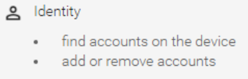
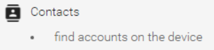
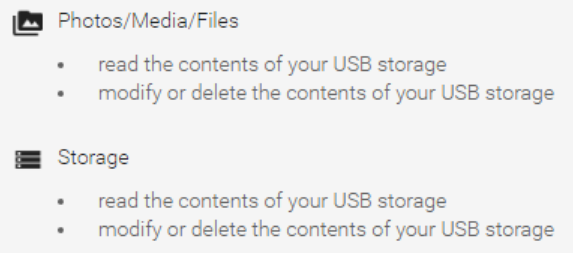
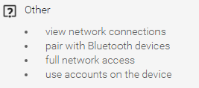

# BeatPrompter Privacy Policy

BeatPrompter will request the following access rights, for the following reasons:

BeatPrompter accesses your cloud storage accounts (Google Drive, Dropbox, OneDrive) to obtain the files containing song lyrics, backing tracks, etc. A Google Drive account is tied to your main Android account, so these access rights are requested by the app, even if you choose to use a different cloud storage system.
Once BeatPrompter authenticates with your chosen cloud storage system, it stores a "passkey token", which is an encrypted piece of information that allows this app, and only this app, to access your account. This encrypted information does not contain your password. BeatPrompter does not have access to any account passwords, and therefore does not and cannot store any account passwords.

BeatPrompter allows you to choose where to store the data that is downloaded from the cloud storage system, in either your device's internal memory, or on external (usually USB) memory. This permission is requested even if you choose to use internal memory.
Despite the wording of this request, BeatPrompter does not access any of your photos. It accesses only the data that it downloads.

BeatPrompter requires internet access to download files from the cloud storage. It also features Bluetooth functionality to allow multiple devices that are running BeatPrompter to operate in sync.

## Further information

- BeatPrompter is friendly software with no hidden agenda.
- BeatPrompter does not "steal" any of your information.
- BeatPrompter does not upload anything to a server (there is no server of any kind ... I doubt I could afford one).
- BeatPrompter does not perform any "data mining".
- BeatPrompter does not display any adverts for anything.
- BeatPrompter was created by me, for my own personal use, and I thought other people might find it useful.
