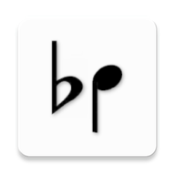
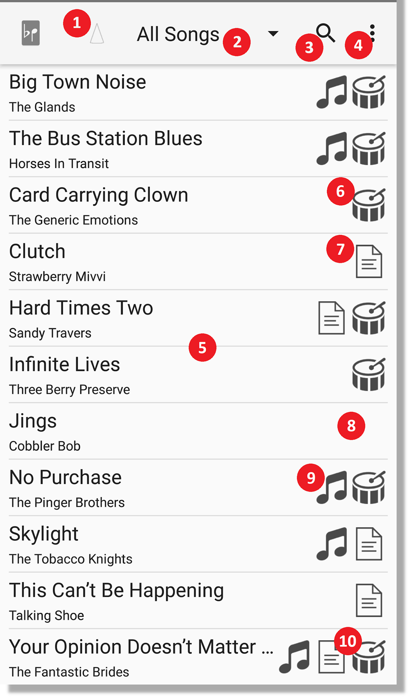
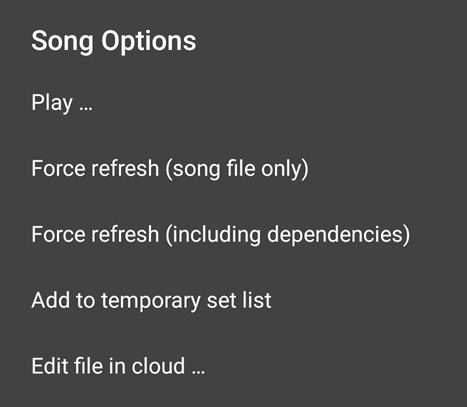
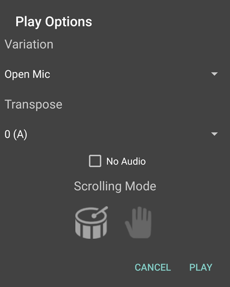
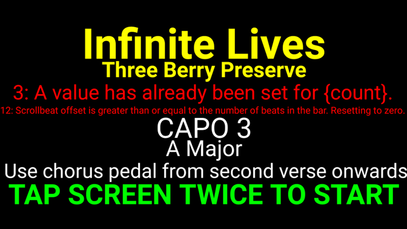
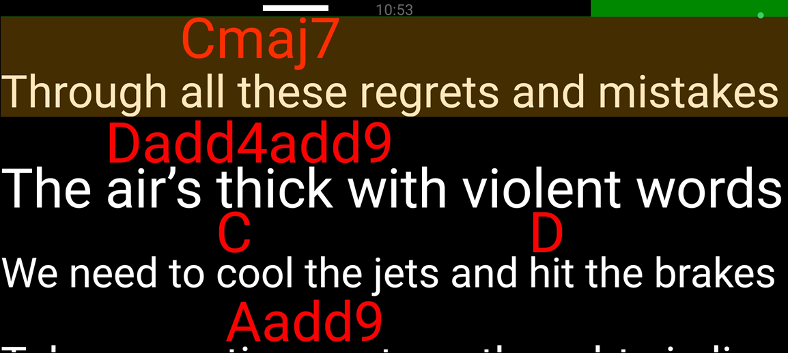

# BeatPrompter Documentation

**BeatPrompter** is a time-sensitive visual prompter app for song lyrics and/or chords which places
a greater emphasis on visibility, timing and rhythm than other similar apps. By defining such things
as beats-per-minute, beats-per-bar, bars-per-line, etc, you can have a greater control over the
display, and by knowing that the on-screen text will definitely be in the right place at the right
time, BeatPrompter can display each line of the song in as large a font as possible, making it more
readable from a greater distance, or for users with imperfect vision.

BeatPrompter can also be used as a MIDI controller. It can respond to and send out MIDI signals at
key moments during a song. See the [separate MIDI documentation](./MIDI.md) for full details.

BeatPrompter reads song files that have been created in the popular ChordPro format, with several
custom additions.

**_BeatPrompter is FREE software. If you like it, please consider making a donation via:_**

<a href="https://www.buymeacoffee.com/peeveen" target="_blank"></a>
<a href="https://www.buymeacoffee.com/peeveen" target="_blank"></a>
<a href='https://ko-fi.com/G2G817J2JM' target='_blank'></a>

## Usage

Before using the BeatPrompter app, you will probably need to do a few things.

1. You cannot use BeatPrompter without some song files to play, so before going any further, you
	 should get some, or create some. They can be created with any text editor. If you want some demo
	 files to play with, try [here](../demo_files/).

2. If you are coming to BeatPrompter with an existing library of ChordPro song files, then you will
	 probably want to update those files with some BeatPrompter-specific tags. To see the full list of
	 tags that BeatPrompter can use, see [Supported Song File Tags](#supported-song-file-tags).

3. Make your song files available to the app. BeatPrompter currently reads files from the popular (
	 and free) [Google Drive](https://www.google.com/drive/), [Dropbox](https://www.dropbox.com/)
	 and [Microsoft OneDrive](https://onedrive.live.com/about/en-gb/) cloud storage services, so your
	 files can be stored in one of these (Google Drive is recommended for the excellent editing
	 facilities). You can also store your song files directly in your device storage. For instructions
	 about synchronizing the content, see [Files](#files).

## Song List

When you first load the app, the song list will contain only the demo song. You will need to tell
BeatPrompter where your song files are stored (see [Files](#files) for details about synchronizing
BeatPrompter with your cloud storage).

Once you have some songs, the list will look something like this (shown here in light mode, though
the app also has a dark mode) ...



1. Bluetooth connectivity indicator. This icon will not be shown if you are not using Bluetooth
	 functionality. Also, it will look different depending on whether you are the band leader or not,
	 and whether or not you are connected.
2. This is the song and set list filter. If your songs contain any `{tag}` fields that specify
	 grouping tags (see the `{tag}` documentation
	 in [Supported Song File Tags](#supported-song-file-tags)), then this will be populated with those
	 values, allowing you to filter the list accordingly. Or if your songs exist in subfolders, the
	 folder names will be listed here. Also, any setlists you have created will be listed here (see
	 Setlists).
3. This button allows you to perform a simple text search of the current list of songs.
4. This is the main app menu. From here you can adjust preferences, synchronize your files, or sort
	 the song list according to various criteria.
5. This is the main list of songs.
6. A drum icon next to a song means that it can be played in “beat mode”, i.e. the song file has
	 timing information encoded into it, such as beats-per-minute, etc.
7. A document icon next to a song means that it can be played in “smooth mode”, where the song just
	 scrolls automatically at a fixed speed.
8. It is possible for a song to use no scrolling modes (if it does not contain a `{bpm}` or `{time}`
	 tag). Such songs can be displayed by BeatPrompter, but will not scroll automatically (“manual
	 mode”).
9. A music-note icon indicates that a song is associated with an audio file, which will be used as a
	 backing track when playing the song.
10. If a song supports multiple scrolling modes, it will use beat-scrolling by default, but you can
		choose what mode to use with a long-press on the song to display the advanced options menu.

## Playing A Song

To play a song, simply tap on the song in the list. If your song can be played in multiple scroll
modes, or has multiple backing tracks that you can choose from, a long press on the song will
display the advanced song options menu, and choosing “Play ...” will allow you to choose the
variation, transpose amount, scrolling mode and no-audio options.

 

Once you select a song to play, you will first see this screen which shows you the song title,
artist, the content of any `{comment}/{c}` tags from the song file, and any errors (with line
numbers) that BeatPrompter has encountered while interpreting the song file.



In this case, the song file has two errors.

- The `{count}` tag has been specified twice on line 3, which makes no sense.
- Also, on line 12, the `scrollbeat` offset has been moved to beyond the end of the following line
	or before the start of the current line, neither of which are permitted.

However, all being well, you are asked to tap the screen twice to start the song. The first tap will
take you to the actual song display screen, and the second tap will start it moving.

> ⚠️ It should be noted that, at this point, the screen orientation is locked. If you want to change
> orientation, you will have to go back to the song list screen first.

## Song Display Screen



- All colors (background, background pulse color, lyrics, chords, beat indicator, current-line
	highlight, etc) can be customized in the preferences menu.
- The lyric at the top of the display is what you should currently be playing/singing.
- In beat scrolling mode, the bar along the top of the display shows what beat the song is currently
	on, and the small white marker shows on which beat the display will scroll to the next line.
	Additionally, the entire background will gently pulse in time to the beat, though this can be
	disabled.
- Tapping the screen will pause/resume the song, and you can also scroll around the song using
	normal scrolling techniques. The song will automatically pause once you start scrolling. If you
	have a backing track, the track will stop while you are scrolling, and resume playing at the
	correct point when the song is started again. You can prevent accidental pausing/scrolling during
	performance by using one of the preference settings.

> This feature requires precise audio positioning, which is highly dependent on the audio format,
> the audio player, and your device capabilities. For best results, use the ExoPlayer audio player (
> configurable via Settings), and uncompressed formats such as WAV, though the accuracy is
> ultimately
> at the mercy of the audio firmware and your device’s specific implementation of the Android
> operating system.

- For each line in the song, BeatPrompter will try to fit it on the screen horizontally, using as
	large a font as possible. Note that you can control the minimum and maximum font size that
	BeatPrompter will use in the preferences menu.
	See [Settings - Song Display](#settings---song-display) for details.
- If a line is very long, or if the minimum font size means that the line cannot fit the screen,
	BeatPrompter will break it over multiple lines.
- ⚠️ Note that BeatPrompter will not display blank lines. If your song file contains lines with no
	lyrics or chords, they will not be displayed, though any tags contained on that line will still be
	processed. The only exception is if you have a “blank” line that starts with commas (bar
	markers) ... in this case BeatPrompter will insert a ▼ blank-line marker into the song display.

## Song Files

A song file is a plain text file that contains additional encoded information about the song. Here
is a short example of a song file:

```custom
{title:Happy Birthday}

Happy [D]Birthday to [A]you
Happy birthday to [D]you
Happy [D7]birthday, dear [G]Steven
Happy [D]birthday [A]to [D]you
```

The `{title}` tag contains the name of the song, and the rest of the file is the song lyrics with
the chords that should be played at the appropriate point in the lyrics. For a simple song like
this, there’s not much more that you need, but what if you a performing a longer song, perhaps with
a backing track, where it is important to keep time with the rhythm, and where you want to guarantee
that the words on the screen will never be too far ahead or scrolling too slowly? Well, that’s where
BeatPrompter comes in.

BeatPrompter allows you to define the speed of a song, either in beats-per-minute for songs with a
distinct rhythm, or in minutes and seconds for more fluid songs. You describe this information to
the app by inserting tags into your song files, much like how the title and chords were inserted
into the simple example above.

## Supported Song File Tags

Below are the tags and symbols that BeatPrompter interprets from a song file.

In cases where a tag has various synonymous names, all are listed.

| Tag                                                                                                                       | Description                                                                                                                                                                                                                                                                                                                                                                                                                                                                                                                                                                                                                                                                                                                                                                                                                                                                                                                                                                                                                                 |
|---------------------------------------------------------------------------------------------------------------------------|---------------------------------------------------------------------------------------------------------------------------------------------------------------------------------------------------------------------------------------------------------------------------------------------------------------------------------------------------------------------------------------------------------------------------------------------------------------------------------------------------------------------------------------------------------------------------------------------------------------------------------------------------------------------------------------------------------------------------------------------------------------------------------------------------------------------------------------------------------------------------------------------------------------------------------------------------------------------------------------------------------------------------------------------|
| `{title:abcd}` `{t:abcd}`                                                                                                 | Defines the title of the song. Unlike other apps that use the ChordPro format, this tag is **mandatory** in a BeatPrompter song file. If a song has no title, it will not be listed.                                                                                                                                                                                                                                                                                                                                                                                                                                                                                                                                                                                                                                                                                                                                                                                                                                                        |
| `{subtitle:abcd}` `{st:abcd}` `{artist:abcd}` `{a:abcd}`                                                                  | Defines the subtitle for the song. In most cases, this is used to describe the original recording artist.                                                                                                                                                                                                                                                                                                                                                                                                                                                                                                                                                                                                                                                                                                                                                                                                                                                                                                                                   |
| `{count:n}` `{countin:n}`                                                                                                 | _This setting is ignored when not using beat mode._ Defines how many bars of count-in there should be before the song (and any backing track) starts.                                                                                                                                                                                                                                                                                                                                                                                                                                                                                                                                                                                                                                                                                                                                                                                                                                                                                       |
| `{tag:blah}`                                                                                                              | Defines a grouping tag for the song. You can define as many of these in a song file as you like. On the main song list screen, you can filter the list by the contents of these grouping tags, so you can ask the app to show only songs marked as “Folk” or “80s”, etc.                                                                                                                                                                                                                                                                                                                                                                                                                                                                                                                                                                                                                                                                                                                                                                    |
| `{bpm:n}` `{beatsperminute:n}` `{metronome:n}`                                                                            | Defines the beats-per-minute speed of the song. This can be a non-integer number if necessary, e.g. `{bpm:74.561}`. This can be redefined as often as once-per-line if a song changes speed throughout.                                                                                                                                                                                                                                                                                                                                                                                                                                                                                                                                                                                                                                                                                                                                                                                                                                     |
| `{beatsperbar:n}` `{bpb:n}`                                                                                               | Defines the number of beats to each bar. This can be redefined as often as once-per-line if a song changes timing throughout. _When BPB changes, the {scrollbeat} is automatically changed. If the difference between the scrollbeat value and the previous BPB can be applied to the new BPB, then the scrollbeat will be set with the same difference. Otherwise, it will be set to the last beat of the bar._                                                                                                                                                                                                                                                                                                                                                                                                                                                                                                                                                                                                                            |
| `{barsperline:n}` `{bpl:n}`                                                                                               | Defines how many bars each line of the song covers. This can be redefined as often as once-per-line if a song changes timing throughout. _Because it is fairly common for a song to have a varying number of bars to each line, a shorthand way of defining the number of bars for individual lines has been implemented. See `{bars}` immediately below._                                                                                                                                                                                                                                                                                                                                                                                                                                                                                                                                                                                                                                                                                  |
| `{bars:n}` `{b:n}` `,`                                                                                                    | This tag can be inserted anywhere in a song line to define how many bars that particular line lasts for. Alternatively, there is another method of defining this which is easier on the eye: the number of commas that a line begins with can also define how many bars that line covers, e.g.<br/><br/> `,,,This line [C]lasts for three [Bm]bars`                                                                                                                                                                                                                                                                                                                                                                                                                                                                                                                                                                                                                                                                                         |
| `{scrollbeat:n}` `{sb:n}` `<` `>`                                                                                         | _Beat-scrolling mode only._ By default, the song display will scroll to the next line on the last beat of the last bar of that line. So if a song has four beats to the bar, it will scroll on (and not after) the fourth beat.<br/>This is not always suitable, as sometimes the vocals for the next line begin before the last beat has completed. To change the beat on which the line scrolls, use this tag. Note that this change applies from that line onwards.<br/>Because it is fairly common for the scroll beat to vary from line to line, a shorthand way of adjusting the scroll beat is available. If a line ends with a number of > or < characters, then the scroll beat (for that line only) will be increased or decreased by one beat accordingly, e.g:<br/><br/>`{scrollbeat:4}[G]This line will scroll on [A#]the 4th beat`<br/>`But [D]this line will scroll on the second!<<`<br/><br/>Remember that reducing the scrollbeat effectively increases the length of the next line by a number of beats, and vice versa. |
| `{pause:n}`                                                                                                               | This causes the scrolling display to pause for a specified amount of time. The number should be in seconds, but does not have to be an integer, e.g. {pause:12.5} is allowed. This pause overrides any beat timing for the line on which the pause occurs, so once the pause ends, the display will scroll to the next line. While the pause is occurring, an on-screen indicator shows how long is remaining.                                                                                                                                                                                                                                                                                                                                                                                                                                                                                                                                                                                                                              |
| `{soh}` `{eoh}` `{soh:#XXXXXX}`                                                                                           | These tags mean start-of-highlight and end-of-highlight. Any text between these tags will be highlighted with the default highlighting color. You can also specify the color to use with the `{soh:#XXXXXX}` tag, where `XXXXXX` is a [hexadecimal color code](https://en.wikipedia.org/wiki/Web_colors).                                                                                                                                                                                                                                                                                                                                                                                                                                                                                                                                                                                                                                                                                                                                   |
| `#`                                                                                                                       | Lines that start with the `#` character are assumed to be comments from the author of the song file, and are not processed.                                                                                                                                                                                                                                                                                                                                                                                                                                                                                                                                                                                                                                                                                                                                                                                                                                                                                                                 |
| `{key:abcd}`                                                                                                              | Declares the key of the song, which can be shown (and sorted) in the song list, and on the title screen.                                                                                                                                                                                                                                                                                                                                                                                                                                                                                                                                                                                                                                                                                                                                                                                                                                                                                                                                    |
| `{audio:abcd}` `{track:abcd}` `{musicpath:abcd}`                                                                          | Defines the audio file that should start playing. Despite the name of the legacy `musicpath` tag, the value should be a name only, not a full path. You can define multiple `{audio}` tags on the same line. These will be associated with variations. See the [Song Variations](#song-variations) section for more detail.<br/><br/>You can also define the volume to play the track at, e.g.:<br/><br/>`{audio:TakeMeAnywhere.mp3:88}`<br/><br/>The volume should be a percentage value between 0 and 100, specifying what percentage of the Default Track Volume setting the track will play at. If not specified, the default is 100%. You can override the Default Track Volume by preceding the volume value with “=”, e.g.:<br/><br/>`{audio:TakeMeAnywhere.mp3:=88}`                                                                                                                                                                                                                                                                |
| `{time:n}`                                                                                                                | _This setting is only used in smooth mode._ This defines how long it should take the display to scroll from the first line of the song to the last line. You can define this in minutes and seconds:<br/><br/>`{time:4:26}`<br/><br/>... or just in seconds:<br/><br/>`{time:312.56}`<br/><br/>BeatPrompter will take this time, subtract any `{pause}` time from it, and divide it by the number of bars in the song. The result is how long each bar will take to pass, so a line that spans one bar will take that amount of time to scroll offscreen, a line that spans two bars will take twice that time, etc.<br/><br/>You can also tell BeatPrompter to use the length of the backing track as the time value with the special `track` token, like this:<br/><br/>`{time:track}`<br/><br/>If you use this token, and then play the song with no backing track (using the advanced options menu), the time will be the length of the first backing track defined in the song file.                                                   |
| `{image:filename}`                                                                                                        | _This tag is ignored when using beat mode._ Shows an image at this point in the song. Most common image formats are accepted. This allows you to simply scan in pages and use the BeatPrompter scrolling facilities to display them. Alternatively, you could insert small sections of handwritten tabs, etc, into normal text displays. Only one image tag is allowed per line. The file specified in the tag must exist in your cloud storage alongside the file that references it.                                                                                                                                                                                                                                                                                                                                                                                                                                                                                                                                                      |
| `{comment:abcd}` `{c:abcd}` `{comment@User:abcd}` `{c@User:abcd}` `{comment@User:abcd###XXXXXX}` `{c@User:abcd###XXXXXX}` | Defines a comment. Note that comments defined _before_ the first line of the song will be displayed on the title screen, while comments defined _after_ the first line will be displayed as popup messages at the foot of the screen while the song is running. You can specify the audience for a comment using the @ symbol. This functionality operates in conjunction with the “Custom Comments User” preference. This prevents a user seeing a comment that isn’t intended for them. For example, only a guitarist would need to know the capo setting for a song, so you could put `{c@Guitarist:Capo 3}`, and only the user who has specified “Guitarist” as their custom comment name would see it. You can also specify multiple names/roles within one comment, e.g. `{c@Bass@BackingVocals:blah}`. You can specify a color (using an extra “###” delimiter as shown). Be aware that comments shown on the song intro screen are always drawn against a black background.                                                         |
| `{beatstart}` `{beatstop}`                                                                                                | If a song contains a mixture of sections that are played to a rhythm, and some that are not, then you can tell BeatPrompter where the beat sections start and stop using these tags. The non-beat sections will not scroll automatically: you will need to use some kind of manual scrolling mechanism until the next beat section is reached (e.g. Bluetooth pedal)                                                                                                                                                                                                                                                                                                                                                                                                                                                                                                                                                                                                                                                                        |
| `{filter_only}`                                                                                                           | This tag will prevent the song from appearing in the “All Songs” list. It will only appear in set lists, tag lists, or subfolder lists. This is generally best used for “special occasion” songs that you don’t want to see in your list all the time (e.g. Christmas songs, etc). As well as using this tag in specific song files, you can create a file (any size) called `.filter_only` in a folder, and all songs in that folder will be treated as if they have the `{filter_only}` tag. This only applies to subfolders, not your “root” folder.                                                                                                                                                                                                                                                                                                                                                                                                                                                                                     |
| `{soc}` `{eoc}`                                                                                                           | Defines the start and end of a chorus section, which will be highlighted with the chorus color preference. Note that, unlike `{soh}` and `{eoh}`, these operate on a line-by-line basis: you cannot denote a line as being partially in the chorus.                                                                                                                                                                                                                                                                                                                                                                                                                                                                                                                                                                                                                                                                                                                                                                                         |
| `{rating:n}` `{r:n}`                                                                                                      | Give the song a rating of your choice, from 1 to 5. You can sort the list by this rating, in descending order of preference, to keep your favourites at the top.                                                                                                                                                                                                                                                                                                                                                                                                                                                                                                                                                                                                                                                                                                                                                                                                                                                                            |
| `{year:nnnn}` `{y:nnnn}`                                                                                                  | The year of release of a song. It can be shown in the song list, and used as sort criteria.                                                                                                                                                                                                                                                                                                                                                                                                                                                                                                                                                                                                                                                                                                                                                                                                                                                                                                                                                 |
| `{icon:blah.png}` `{i:foo.jpg}`                                                                                           | An icon that is associated with the song.It can be shown in the song list, and used as sort criteria. The value should be the name of an image file that is found in your cache of files (most image formats are supported). The image will be scaled down to fit the icon size, so there is not much point in using large detailed images. If the named icon is not found in your cache of files, a placeholder icon will be shown.                                                                                                                                                                                                                                                                                                                                                                                                                                                                                                                                                                                                        |
| `{variations:a,b,c,...}`                                                                                                  | Defines named song variations, separated by commas. This tag should exist at an early point in your song file.                                                                                                                                                                                                                                                                                                                                                                                                                                                                                                                                                                                                                                                                                                                                                                                                                                                                                                                              |
| `{varxstart:a,b,...}` `{varxend}` `{varxstop}` `{varstart:a,b,...}` `{varend}` `{varstop}`                                | Defines “variation exclusion” sections. Lines between the `{varxstart}` and `{varxstop/varxend}` tags (inclusive) are discarded when performing any of the named variations. The “variation inclusion” tags (`varstart` and `varstop/varend`) are included for convenience. Internally, they are converted to exclusion tags with an “opposite” set of variation names.                                                                                                                                                                                                                                                                                                                                                                                                                                                                                                                                                                                                                                                                     |
| `{transpose:value}`                                                                                                       | Transposes all chords by the given amount. The `value` can be a number of semitones to shift by (from -11 to 11), or a new key signature, in which case the chords will be shifted from the song key (defined by `{key}`, or estimated from the first chord) to the target key. _Note that this tag only affects chords that are on or after the line that the {transpose} tag is defined on._                                                                                                                                                                                                                                                                                                                                                                                                                                                                                                                                                                                                                                              |
| `{chord_map:x=y}`                                                                                                         | Adds a new mapping to the chord map. Any chords with names that exactly match the value of `x` will be changed to the value of `y`. As with {transpose}, this only affects chords on or after the line that the `{chord_map}` tag is defined on.                                                                                                                                                                                                                                                                                                                                                                                                                                                                                                                                                                                                                                                                                                                                                                                            |
| `{capo:n}`                                                                                                                | Defines the capo (or manual transpose) required to perform the song. By defining this, you allow BeatPrompter to derive the key of the song more accurately. You can also configure the app to show the capo setting on the title screen of the song.                                                                                                                                                                                                                                                                                                                                                                                                                                                                                                                                                                                                                                                                                                                                                                                       |
| `{no_chords}`                                                                                                             | If this tag is encountered, then from this line onwards, all `[chord]` tags are ignored.                                                                                                                                                                                                                                                                                                                                                                                                                                                                                                                                                                                                                                                                                                                                                                                                                                                                                                                                                    |
| Other tags                                                                                                                | Other tags, even those used by similar apps, are ignored. Not many of them are applicable to the functionality of BeatPrompter. BeatPrompter is geared towards live performance, so showing things like “tab” notations or illustrative chord fingering diagrams is not really practical.                                                                                                                                                                                                                                                                                                                                                                                                                                                                                                                                                                                                                                                                                                                                                   |

## Files

BeatPrompter reads files from various different storage systems. The currently supported systems
are:

- [Google Drive](https://www.google.com/drive/)
- [Dropbox](https://www.dropbox.com/)
- [Microsoft OneDrive](https://onedrive.live.com/about/en-gb/)
- Local device storage

> Google Drive will only be available if Google Play Services are installed and available, and you
> may find that you will need to manually grant BeatPrompter access to your files using the
> Permissions settings.

Before it can download your data, you must tell BeatPrompter where your data is stored.

1. Go to the `Settings` > `Files` page.
2. Select `Storage System`. You will be prompted to choose which of the available systems you want
	 to use.
3. Select `Storage Folder`.
	- If this is the first time you have done this, you might see one or more security prompts asking
		you to verify that you want to allow BeatPrompter to access your storage. You have to agree to
		this in order to use BeatPrompter.
	- Depending on what storage system you are using, you may also see a prompt asking you to choose a
		user account. You should respond appropriately.
4. If BeatPrompter successfully connects to your storage, then all being well, you should see a
	 folder browser. Browse to the location where your files are stored and press OK.
5. BeatPrompter can now download your data. From the main app menu, select `Synchronize Files` from
	 the menu. The amount of time that this process takes will depend on the type of storage that you
	 are using, and the volume of data and the speed of the connection.

> ℹ️ **Note that, if using Google Drive, your song files don’t have to be stored as .txt, or
.chopro, or any particular text format.** Any format that can be interpreted as text can be used,
> including the Google Docs format. This format is particularly useful, as you can create and edit
> these files directly in the Google Drive app. Also, if you find the `{tags}` and annotations
> annoying when you are simply sight-reading your files, you can reduce their size to near-zero, or
> change their color to white/near-white so that they are largely invisible: BeatPrompter will still
> see them!

> ⚠️ In Dropbox and OneDrive, your song files must be plain text (.txt) files.

Once all the data has been downloaded, the BeatPrompter app will scan the downloaded files and
present you with a list of usable songs.

> ⚠️ Note that song files that do not contain a title (specified with `{title}` or `{t}`) will **not
** be listed.

## Single File Refresh

If you make a change to a file, then there is a simple way to update that one song, rather than
doing a full synchronization. Long-press the song in the song list, and you will see this menu:


Choosing “Force refresh (song file only)” will re-download the song file from the cloud storage.

Choosing “Force refresh (including dependencies)” will re-download the song file and any
accompanying audio/image files from the cloud storage.

If you are currently displaying a set list, a third option of “Force refresh of set list” will be
available, and will re-fetch the current set list file.

> These options are especially useful for Google Drive users, as small modifications to files
> sometimes take several minutes before they are reflected in the last-modified date of the file,
> meaning that a normal synchronization does not see the file as having changed.

## Editing Files

If the currently-selected storage system supports editing files, you will see one or more “edit”
options on the long-press menu. Selecting these will launch a cloud-specific text editor, allowing
you to make changes. Note that, by doing this, you are editing the **remote cloud version of the
file**, and will still have to refresh/sync your file to see any changes in BeatPrompter.

> ⚠️ Making lengthy edits on a mobile device is not really recommended! This function is really just
> included for making small corrections to existing files.

## Settings

BeatPrompter has an extensive set of preferences which allow you to customize the app to suit your
needs. You can access the preference settings from the main app menu, by simply selecting
“Settings”. Here are full descriptions of each preference section, and the preferences contained
within.

| Section         | Description                                                                                                                                                                                                                  |
|-----------------|------------------------------------------------------------------------------------------------------------------------------------------------------------------------------------------------------------------------------|
| Files           | In this page, you set up the storage system (Google Drive, Dropbox, OneDrive or Local) that you want to use, and tell BeatPrompter what folder it should fetch your song data from.                                          |
| Song List       | These options control the appearance of the main list of songs.                                                                                                                                                              |
| Song Display    | These options control the appearance and behaviour of the song display screen.                                                                                                                                               |
| Audio           | These options control how BeatPrompter plays audio.                                                                                                                                                                          |
| MIDI            | These settings control how BeatPrompter sends, or responds to, MIDI messages via USB. See [separate MIDI documentation](./MIDI.md) for details.                                                                              |
| Bluetooth       | These options control the Bluetooth communication between multiple band members who are using the app. **If this section is disabled, you will probably have to enable the Bluetooth permission in the Permissions screen.** |
| Permissions     | Allows you to grant additional permissions to the app.                                                                                                                                                                       |
| Buy Me A Coffee | This will open a webpage where you can buy me a coffee. I recommend that you should use this option as often as possible.                                                                                                    |

## Settings - Files

| Setting            | Description                                                                                                                                                                                                                      |
|--------------------|----------------------------------------------------------------------------------------------------------------------------------------------------------------------------------------------------------------------------------|
| Storage System     | This has four options: Google Drive, Dropbox, Microsoft OneDrive, or Local Storage. Choose the one that your song files are stored in. ⚠️ **Note that Local Storage is only available if enabled via the Permissions settings.** |
| Storage Folder     | This option allows you to choose the folder that your songs are in. When you first select this option, you may be prompted to permit BeatPrompter to access your storage.                                                        |
| Include Subfolders | Determines whether files within subfolders will also be fetched.                                                                                                                                                                 |
| Clear Cache        | Pressing this will delete all downloaded files.                                                                                                                                                                                  |

## Settings - Song List

| Setting                         | Description                                                                                                                                                                                                                                                                                                                                                                     |
|---------------------------------|---------------------------------------------------------------------------------------------------------------------------------------------------------------------------------------------------------------------------------------------------------------------------------------------------------------------------------------------------------------------------------|
| Show scroll style icons         | If this preference is set, then the scroll-style indicators (the drum and/or the document) will be shown in the song list. If you don’t want to see these, switch this preference off.                                                                                                                                                                                          |
| Show music icon                 | If this preference is set, an icon against each song will indicate whether it has a backing track or not. If you don’t want to see this, switch this preference off.                                                                                                                                                                                                            |
| Bigger text                     | Displays the song list in larger text. Best suited to larger display devices like tablets.                                                                                                                                                                                                                                                                                      |
| Show key                        | The key of the song (either calculated from the song chords, or explicitly defined by a `{key}` tag) will be shown next to each song in the list.                                                                                                                                                                                                                               |
| Show rating                     | The rating of the song will be shown next to each song in the list.                                                                                                                                                                                                                                                                                                             |
| Show year                       | The year of release of the song will be shown in the list (if defined).                                                                                                                                                                                                                                                                                                         |
| Song icon display position      | Where/whether to show song icons (if defined)? You can choose “None” to never show song icons, “Left” to display any icons to the left of the song title, “Icon Section, Left” to display the song icon as the leftmost icon in the icon section (to the right of the song title), or “Icon Section, Right” to display the song icon as the rightmost icon in the icon section. |
| Clear tags when filter changes? | When you change the “main” filter (folder/setlist/etc), all selected tag filters will be cleared. If you’d prefer to keep them selected as you move between folders, switch this off.                                                                                                                                                                                           |

## Settings - Song Display

| Setting                                | Description                                                                                                                                                                                                                                                                                                                                                                                                                                                                                                                                                                                                                                                                                                                                                                                                                       |
|----------------------------------------|-----------------------------------------------------------------------------------------------------------------------------------------------------------------------------------------------------------------------------------------------------------------------------------------------------------------------------------------------------------------------------------------------------------------------------------------------------------------------------------------------------------------------------------------------------------------------------------------------------------------------------------------------------------------------------------------------------------------------------------------------------------------------------------------------------------------------------------|
| Colors                                 | In this preference page, you can define the colors that the app will use for various display elements.                                                                                                                                                                                                                                                                                                                                                                                                                                                                                                                                                                                                                                                                                                                            |
| Font sizes                             | In this preference, you can define the minimum and maximum font size that BeatPrompter will use to display song lyrics and chords. If you set the minimum font size to too large a value, then you might find that song lines start to get broken up across multiple lines. You can define different minimum and maximum values for beat-scrolling mode and smooth-scrolling mode, as it may be preferable to have smaller text in smooth-scrolling mode, due to the timing of the scrolling being less precise. You can also tell BeatPrompter to always use the beat-scrolling font size preferences for all songs, if you are not interested in this feature.                                                                                                                                                                  |
| Preferred variation                    | When you load a song normally, the variation that matches this value will be loaded. If no variations match this value, then the first variation is loaded as normal.                                                                                                                                                                                                                                                                                                                                                                                                                                                                                                                                                                                                                                                             |
| Background pulse                       | Enable or disable the background pulse in beat mode.                                                                                                                                                                                                                                                                                                                                                                                                                                                                                                                                                                                                                                                                                                                                                                              |
| Show scroll indicator                  | Enable or disable the marker that appears in beat mode that shows when the display will scroll to the next line.                                                                                                                                                                                                                                                                                                                                                                                                                                                                                                                                                                                                                                                                                                                  |
| Beat counter text overlay              | What text (if any) to show over the top of the beat counter. Options are nothing (default), the song title, or the current time.                                                                                                                                                                                                                                                                                                                                                                                                                                                                                                                                                                                                                                                                                                  |
| Show song key on title screen          | The key of the song (either calculated from the song chords, or explicitly defined by a `{key}` tag) can be shown on the title screen if this is selected.                                                                                                                                                                                                                                                                                                                                                                                                                                                                                                                                                                                                                                                                        |
| Show song BPM on title screen          | If selected, the first BPM setting encountered in the song file will be displayed on the song title screen. You can choose to display the exact BPM, or rounded to an integer in case it is fractional.                                                                                                                                                                                                                                                                                                                                                                                                                                                                                                                                                                                                                           |
| Show capo setting on title screen      | If selected, the value of the `{capo:n}` tag will be shown on the title screen (if defined).                                                                                                                                                                                                                                                                                                                                                                                                                                                                                                                                                                                                                                                                                                                                      |
| Show chords                            | Enable or disable the display of chords.                                                                                                                                                                                                                                                                                                                                                                                                                                                                                                                                                                                                                                                                                                                                                                                          |
| Always Show Sharp Chords               | Any flat chords will be converted to appropriate sharp chords. Some musicians prefer this. This preference only applies to valid chords.                                                                                                                                                                                                                                                                                                                                                                                                                                                                                                                                                                                                                                                                                          |
| Display Unicode Accidentals            | Any “b” or “#” characters in chords will be replaced with “♭” or “♯” symbols. This preference only applies to valid chords.                                                                                                                                                                                                                                                                                                                                                                                                                                                                                                                                                                                                                                                                                                       |
| Trim trailing punctuation              | If a line ends with a single comma or full-stop character, it will be removed.                                                                                                                                                                                                                                                                                                                                                                                                                                                                                                                                                                                                                                                                                                                                                    |
| Use Unicode ellipsis                   | Sequences of exactly three dots in a file will be replaced by the Unicode ellipsis character (…). Note that, on some systems, this doesn’t look very different.                                                                                                                                                                                                                                                                                                                                                                                                                                                                                                                                                                                                                                                                   |
| Highlight current line                 | If selected, the line which is currently being performed will be highlighted with the user-defined color. Only applicable in beat scrolling mode.                                                                                                                                                                                                                                                                                                                                                                                                                                                                                                                                                                                                                                                                                 |
| Show page down scroll position markers | Enable or disable the markers that indicate where the display will scroll to when you press page down (manual mode only).                                                                                                                                                                                                                                                                                                                                                                                                                                                                                                                                                                                                                                                                                                         |
| Highlight start of beat sections       | In mixed-mode (a song that contains `{beatstart}`/`{beatstop}` tags), you can decide whether or not to highlight the start of the beat sections in the user-defined color.                                                                                                                                                                                                                                                                                                                                                                                                                                                                                                                                                                                                                                                        |
| Default count-in                       | If a song uses beat scrolling, and does not explicitly contain a {count} tag, then this preference defines how many bars of count-in rhythm will be played before the song starts.                                                                                                                                                                                                                                                                                                                                                                                                                                                                                                                                                                                                                                                |
| Comment Display Time                   | Comments that appear while the song is playing will appear at the foot of the screen for a specified number of seconds, depending on the value of this preference. If another comment is triggered before this time is up, the old comment is replaced.                                                                                                                                                                                                                                                                                                                                                                                                                                                                                                                                                                           |
| Custom Comments User                   | This operates in conjunction with the `{c}` or `{comment}` tags in a song. If you are using BeatPrompter in a band, where more than one person has their own BeatPrompter display, then you might find that the information you put on the song introduction screen using the `{c}`/`{comment}` tags becomes overly complicated. It would be best if a band member only saw comments that affected their part of the song. You can specify your name/role in this setting (e.g. “Bassist”), and you will only see comments that either have no defined special audience, or comments that start with `{c@Bassist:...}`. If you have multiple roles in a band (e.g. bass and backing vocals) and want to see the comments that are targeted at each role, you can put multiple names in this field by separating them with commas. |
| Controls during performance            | You can configure the behavior of clicking/swiping the song display screen. If you are using BeatPrompter in a performance scenario, it may be preferable to restrict the functionality while the song plays, in case an accidental touch ruins your performance. The options available are:<br/><br/>**Scrolling, pausing, restarting** = you can scroll around the song, pause and restart. NOTE: In manual scrolling mode, scrolling is always enabled.<br/><br/>**Volume** = swiping up and down on the screen will adjust the volume of the backing track. Alternatively, tapping in the top or bottom half of the screen will increase/reduce the volume by 5% each time.<br/><br/>**Nothing** = all screen controls are disabled while a song is playing.                                                                  |
| Automatically Play Next Song           | When a song ends, it can move on to the next song automatically based on what you choose for this option.<br/><br/>**Always** = Always move to the next song<br/><br/>**Never** = Never move to the next song, always return to the song list.<br/><br/>**Set Lists Only** = Move to the next song if you are playing a set list.                                                                                                                                                                                                                                                                                                                                                                                                                                                                                                 |
| Mimic Band Leader Display              | If you are a “band member” synced to the leader via Bluetooth, and the band leader starts a song in manual mode, then if this preference is set, your display will attempt to mimic the orientation and font sizes of the leader. Due to the variety of screen width-to-height ratios, this will probably not yield a “perfect” match, but should hopefully be “close enough for jazz”.                                                                                                                                                                                                                                                                                                                                                                                                                                           |
| Proximity Sensor Scrolls Page          | If selected, the proximity sensor on your device can be used to trigger a “page down” event.                                                                                                                                                                                                                                                                                                                                                                                                                                                                                                                                                                                                                                                                                                                                      |
| Any other key is page-down             | If selected, any other keyboard event received (for example, from a Bluetooth keyboard) will be treated as a page-down keypress.                                                                                                                                                                                                                                                                                                                                                                                                                                                                                                                                                                                                                                                                                                  |
| Manual Mode                            | If selected, all songs will, by default, play in manual scrolling mode with no backing track. This is a handy shortcut setting for when your drummer actually shows up.                                                                                                                                                                                                                                                                                                                                                                                                                                                                                                                                                                                                                                                           |

## Settings - Audio

| Setting              | Description                                                                                                                                                                                                                                                                                                                                                                                                                                                                                                                                                        |
|----------------------|--------------------------------------------------------------------------------------------------------------------------------------------------------------------------------------------------------------------------------------------------------------------------------------------------------------------------------------------------------------------------------------------------------------------------------------------------------------------------------------------------------------------------------------------------------------------|
| Audio Player         | You can control what component is used internally by the app for audio playback. The choices are the standard Android [MediaPlayer](https://developer.android.com/guide/topics/media/platform/mediaplayer), or [ExoPlayer](https://developer.android.com/guide/topics/media/exoplayer). I have found that, on more modern devices, ExoPlayer gives much better accuracy when starting audio tracks from a non-zero time offset. Basically, if you’re having trouble with one, maybe try the other.                                                                 |
| Default track volume | When a song has a backing track, it will, by default, play at this volume. Note that this is also constrained by the main volume control on your device, so setting this to 100% will only play at 100% of the current media volume setting.<br/><br/>Tip: if you use BeatPrompter in a performance environment, set this to 75-80%, and set “Controls During Performance” to “Volume”. This way, if you find one of your backing tracks is a little too loud, or too quiet, you can quickly adjust the volume on-the-go with a couple of taps.                    |
| Metronome click      | You can tell BeatPrompter to generate a metronome-style click (actually more like a closed hi-hat tap) in time to the beat. Your options are:<br/><br/>**On** = the click will play on every beat<br/><br/>**On when no backing track** = if there is no backing track to play, this behaves like the “On” option. Otherwise, it is “Off”.<br/><br/>**Off** = the click will never play<br/><br/>**During count-in** = the click will only play during the {count} beats.<br/><br/>In manual mode, a constantly-on metronome can be “reset” by tapping the screen. |
| Mute                 | If selected, no audio tracks or metronome clicks (apart from count-in) will play, regardless of other settings.                                                                                                                                                                                                                                                                                                                                                                                                                                                    |
| Audio Latency        | If you are playing your audio through a device that adds latency, you can compensate for it with this setting. If set to a value greater than zero, the app audio will start playing slightly earlier than the other song events (beats, etc).                                                                                                                                                                                                                                                                                                                     |

## Settings - MIDI

[See separate documentation](./MIDI.md)

## Settings - Bluetooth

| Setting                | Description                                                                                                                                                                                                                                                                                                                                                                                                                                                               |
|------------------------|---------------------------------------------------------------------------------------------------------------------------------------------------------------------------------------------------------------------------------------------------------------------------------------------------------------------------------------------------------------------------------------------------------------------------------------------------------------------------|
| Bluetooth Mode         | Options are:<br/><br/>**None**<br/>**Band Leader (server)**<br/>**Band Member (client)**<br/><br/>If you are the “Band Leader”, then users with a mode of “Band Member” will automatically connect to your device via Bluetooth (if your devices are paired). The actions of the band leader that are mirrored on connected users devices are:<br/><br/>**Selecting, starting and stopping a song.**<br/>**Scrolling**<br/>**Pausing and restarting a song in progress.** |
| Band Leader Device     | If you are operating as a “band member” in a Bluetooth-synced group, choose the band leader’s device from the list here. If it does not appear here, you should pair your devices using the Bluetooth functionality of the operating system.                                                                                                                                                                                                                              |
| Bluetooth MIDI Devices | This setting allows you to choose which paired Bluetooth devices BeatPrompter should attempt MIDI communication with.                                                                                                                                                                                                                                                                                                                                                     |

## Settings - Permissions

| Setting   | Description                                                                                                                                                                                                                                                                                                                   |
|-----------|-------------------------------------------------------------------------------------------------------------------------------------------------------------------------------------------------------------------------------------------------------------------------------------------------------------------------------|
| Bluetooth | To use BeatPrompter in a group context, or to use Bluetooth MIDI, your devices need to communicate via Bluetooth. On Android 12 (or later) devices, you will need to manually grant BeatPrompter the permission to use Bluetooth. If this is not granted, the Bluetooth settings screen will be disabled.                     |
| Storage   | If you want to use locally-stored files, you must grant BeatPrompter the ability to read your local storage. If this is not granted, only cloud storage will be available. ⚠️ **Note that Android 12 (and later) devices have heavily restricted this permission, and it may not be possible to grant, even if you want to.** |

> Each permission is shown as “Granted” or “Denied”. If the permission is currently Denied, clicking
> on it should start the permission-granting process. If you want to revoke previously-granted
> permissions, uninstall and re-install the app.

## Bar precedence

If multiple “number of bars” tags exist on one line, the precedence order is (in descending order of
precedence):

1. Shorthand commas
2. `{bars:n}` or `{b:n}`
3. `{bpl:n}` (though, of course, this affects subsequent lines)

## Manual Mode

If a song has no defined timing information (either `{bpm}` or `{time}` tags) then it will only
operate in manual mode. In this mode, the song will not scroll or progress automatically, and you
can only scroll manually in the normal way.

However, if you have a Bluetooth pedal you can use manual mode to perform songs without encoding
timing into them, scrolling the screen with your pedal as necessary.

If you are using the metronome-click in manual mode, tapping the screen will “reset” the click.

## Bluetooth pedals

BeatPrompter can make use of Bluetooth pedal devices, such as AirTurn, etc.

If a song is at the title screen, pressing any pedal will move to the song view.

In beat scrolling or smooth scrolling mode, if a song is unstarted or paused, pressing any pedal
will start or resume the song.

If a song is being displayed in manual scrolling mode, then you can use a pedal device to scroll the
display, either by:

- a line at a time (using the up-arrow/down-arrow mode of the device), or
- a page at a time (using the page-up/page-down mode).

You can also use the pedal to control the volume of any backing tracks while they are playing.

- In beat scrolling or smooth scrolling modes, any of the pedal modes will control the backing track
	volume, raising or lowering the volume by 5% with each press.
- In manual scrolling mode, the volume is controlled by the left/right arrow function of the pedal
	device.
- In manual scrolling mode, if it is not possible to scroll any further, then three quick presses of
	the “down” pedal will take you back to the song list screen (or if you are currently using a set
	list, to the next song).

Consult your pedal documentation for instructions on how to change the mode of your pedal.

Alternatively, if you are too cheap to buy a Bluetooth pedal, consider using the “Proximity sensor
scrolls page” preference.

## Song Variations

For each song, you can define named variations, and each variation can use a subset of the lines in
the song. For example, you might want a song to include a long instrumental section suitable for a
guitar solo when performing with a band, but not when you are performing a solo acoustic version. To
achieve this, you define variations.

The `{variations}` tag should appear near the start of your song file, containing a comma-separated
list of variation names. For example:

```
{variations:Full Band, Acoustic Duo, Acoustic Solo}
```

Now, you can define sections that are excluded for certain variations. In the section you want to
exclude for one or more particular variations, you would use:

```
…
{varxstart:Acoustic Duo, Acoustic Solo}
… section of song that will be excluded for acoustic performances …
{varxend}
…
```

The lines between the `{varxstart}`/`{varxend}` tags (including the lines that the tags are on) will
be ignored when you select to play the “Acoustic” variations.

If you load a song using the normal single-tap from the song list, the “default” variation is
played, which is the first named variation (in the above example, this would be “Full Band”). To
play a specific named variation, use the long-press dialog.

### Song Variations and `{audio}` Tags

If multiple `{audio}` tags are found on a line (and it must be the **same line**), it is assumed
that each tag corresponds to a variation. They are associated in order, i.e. the first audio tag is
associated with the first named variation, and so on. When you select a named variation to play,
only the audio tags that correspond with that variation will be used.

If you define multiple audio tags without first defining named variations, the audio file names will
implicitly be used as the variation names.

If you define more audio tags than variations, the leftover tags will be ignored, and you will see
an error on the song title screen.

If you define fewer audio tags than variations, the last audio tag in the line will be used for all
remaining variations.

## Setlists

To create setlists (predefined lists of songs in a specific order) in BeatPrompter, simply create a
text file in your cloud storage that looks something like this:

```custom
{set:My Set List}
Erica
It All Depends On Me
The Landlord
# You can add comments like this.
Left Handed Men
Sometimes===Erasure
Backless Number###Acoustic
… etc
```

Once it has been downloaded, BeatPrompter will recognize this as a set list file (because of the
`{set}` tag) and will add it to the filter combo box on the main song list view, with a “list” icon
to differentiate it from tag sets. ⚠️ **Note that the titles of the songs in the set list must
EXACTLY match the titles of the songs in your song collection**, otherwise BeatPrompter will display
a warning when you open the set list, displaying the names of the unknown songs.

If your collection of songs contains multiple songs with the same title, you can disambiguate the
set list entry by adding the artist, as shown in the example above. Use `===` (triple equals) as a
delimiter.

If you want to use a specific non-default variation in a set list, you can similarly denote the
variation name after the song name using a `###` delimiter (also shown above).

### Refreshing Set List File Content

Once BeatPrompter has loaded your set list file from cloud storage, you can force a refresh of the
file contents in a similar way to how you force a refresh of song files. Simply open the set list
from the filter combo box on the main song list view, and long-press any of the songs in the set
list. As well as options to refresh the song you have selected, you will see an additional option to
refresh the set list.

### Auto-Progression

By default, BeatPrompter will automatically move to the next song in the set once the current song
has finished. To play through a set list from any point, just start the song that you want to start
playing from. If you always want BeatPrompter to return to the song list after a song is completed,
change the value of the “Automatically Play Next Song” preference accordingly.

### Skipping The Current Song

If you have enabled BeatPrompter to progress through sets automatically, there will be an additional
section on the title screen of each song, showing you what song is coming next. You can instantly
skip the current song by clicking on this section.

### Temporary Setlist

You can compile a temporary set list by long-pressing on songs and choosing “Add to temporary set
list”. The set list called “Temporary” will then appear in the dropdown list. A long-press on any of
the songs in the Temporary set list will give you the option to clear the temporary setlist.

## Version History

See the [separate version history document](./HISTORY.md).

## Donate

I have put a lot of work into this largely-misunderstood app. If you’re one of those special people
who “get it”, maybe buy me a drink for my efforts? I am happy to accept any donations via:

<a href="https://www.buymeacoffee.com/peeveen" target="_blank"></a>
<a href="https://www.buymeacoffee.com/peeveen" target="_blank"></a>
<a href='https://ko-fi.com/G2G817J2JM' target='_blank'></a>

Thanks!

## Bug Reports & Suggestions

I hope you like BeatPrompter, but if there’s anything you think is missing, or could be improved,
please let me know via [email](mailto:steven.fullhouse@gmail.com).

If you find any bugs, please email me the song file that you are using so that I can test it, along
with the minimum and maximum font size values you are using, and the make & model of device that is
running the app.

I created BeatPrompter for my own use in live performances. I “eat my own dog food”, as the
marketing people like to say, so I really don’t want it to fail.

I am an ignorant Brit, so the translations for the various languages were done using Google
Translate. If there is anything unpleasant in there, then I blame Google.

BeatPrompter was created with Android Studio, and was tested, and confirmed as working, with the
following devices:

- Huawei P10 Plus (Oreo)
- Samsung Galaxy S9 (Oreo)
- Acer Iconia One (KitKat)
- Redmi Note 13 (Android 14)

Bluetooth pedal functionality was tested with an AirTurn PED BlueTooth pedal (various modes tested).
It has also been seen working with a Donner page turner.

So far, MIDI functionality has been tested with the following devices and software utilities:

- Pigtronix Infinity Looper
- Boss RC-10R
- TC-Helicon VoiceLive 3 Extreme
- MIDI-OX (Windows PC)
- `sendmidi.exe` (Windows PC)
- FL Studio (Windows PC)

## Known Bugs

- If a song contains a `{pause}`, MIDI song position pointer messages can produce out-of-sync
	results. Mixing these two features is not really advised.
- No version checking in Bluetooth communication messages. If you attempt to synchronize different
	versions of the app via Bluetooth, expect crashes. Just make sure everyone is using the latest (or
	at least, the same) version.
- Metronome functionality in mixed-mode songs has not yet been properly implemented.
- Due to how Google Drive converts carriage returns in Google Docs files to text, the line numbers
	in any error messages might be slightly off.

## Troubleshooting

- If you have problems using any of the cloud services, try deleting all cached data pertaining to
	the particular cloud app using your Android application manager settings.
- If your files are downloading but not appearing in the song list, make sure there is at least a
	`{title:Blah}` or `{t:Blah}` tag in the song file. Any text file that is downloaded that does *
	*not** have a title declared **within** it is assumed **not** to be a song file, and will not be
	treated as one.

## Acknowledgements

Thanks to my wife Jules for putting up with me spending hours writing this.

And thanks to these power-users for their dogged vigilance, excellent feature requests, and coffee
support. Without their input, this app would have half as much functionality and twice as many bugs.

- Matt Carr
- Jörg Goertz
- Roger Leonhardt